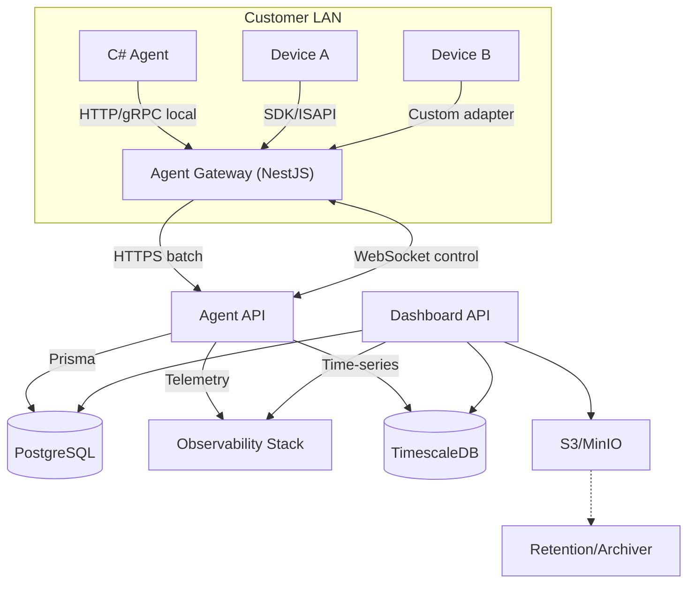

# Staff Control System v2.0 – Texnik Dizayn va Migratsiya Rejasi

## 1. Maqsad va doira
- **Maqsad:** Amaldagi v1.0 arxitekturasini korporativ miqyosda barqaror, xavfsiz va kengaytiriladigan v2.0 yechimiga yangilash.
- **Doira:** Backend xizmatlar (dashboard-api, agent-api), yangi gateway servisi, fayl saqlash, monitoring, TimescaleDB integratsiyasi, policy va device boshqaruvi, ma'lumotlar bazasi RLS va migratsiya strategiyasi.
- **Natija:** Uzoq muddatli roadmap uchun tayyor bo'lgan, offlayn-ishchi agentlar va murakkab qurilma integratsiyasini qo'llab-quvvatlaydigan platforma.

## 2. Asosiy talablar (functional + non-functional)
- **Agent ma'lumotlari xavfsiz yig'ilishi:** Gateway orqali lokal yig'ish, buferlash, batch tarzda HTTPS bilan yuborish.
- **Agent on/offline statusi:** Gateway va asosiy server o'rtasida WebSocket (yoki gRPC streaming) kanal orqali real-time status.
- **Policy boshqaruvi:** Policy o'zgarishi agentlarga yetkazilishi, restart va konfiguratsiya qo'llanilishi.
- **Qurilmalar integratsiyasi:** Plagin asosidagi device adapterlari, main serverdan boshqaruv, gateway orqali oraliq qatlam.
- **Multi-tenancy xavfsizligi:** PostgreSQL darajasida RLS, `ADMIN` roli uchun global ko'rish, boshqalar uchun `organization_id` izolatsiyasi.
- **Monitoring va observability:** Katta dataset uchun metrikalar, tracing, loglarni markazlash.
- **Fayl saqlash abstraksiyasi:** Screenshot, credential, profil, arxivlarni moslashuvchan storage orqali boshqarish, retention rejasi.
- **TimescaleDB integratsiyasi:** ActiveWindow, VisitedSite kabi monitoring ma'lumotlarini vaqtga bog'liq bazada saqlash.
- **Migratsiya**: Bosqichma-bosqich, minimal downtime bilan.

## 3. Hozirgi holat (v1.0) tahlili
### 3.1 Arxitektura
- **Monorepo:** Nx asosida `apps/` (dashboard-api, agent-api, e2e) va `shared/` kutubxonalari (auth, common, database, repository, utils).
- **Backend:** NestJS v11, Prisma, PostgreSQL.
- **Agent API:** C# agentlardan ma'lumot qabul qilish (hozircha to'g'ridan-to'g'ri).
- **Dashboard API:** Hodimlar, tashkilot, qurilma boshqaruvi.

### 3.2 Ma'lumotlar bazasi (Prisma modeli)
- `Organization`, `Department`, `Employee`, `Policy`, `User` asosiy jadvallar.
- Monitoring jadvallar: `ActiveWindow`, `VisitedSite`, `Screenshot`, `UserSession` (`UsersOnComputers` bilan bog'langan).
- Device loglari: `Action`, `Device`, `Gate`, `Visitor`, `Credential`.
- Resource/policy konfiguratsiyasi: `PolicyOption`, `RuleGroup`, `ResourceGroup`, `Resource`.
- Hammasi bitta PostgreSQL instansiyasida, RLS yo'q.

### 3.3 Bo'shliqlar
- Agent API to'g'ridan-to'g'ri internetga ochiq (xavf, beqarorlik).
- Fayl saqlash lokalga bog'langan.
- Monitoring ma'lumotlari hajmi katta; PostgreSQL muammoga aylanadi.
- Tenant izolatsiyasi dasturiy ustunlikka tayanadi (Middleware), DB darajasida emas.
- Observability minimal.

## 4. Taklif etilayotgan arxitektura (v2.0)
### 4.1 Komponentlar


### 4.2 Topologiyalar
| Qatlam | Texnologiya | Joylashuv |
|--------|-------------|-----------|
| Gateway | NestJS microservice | Mijoz LAN (Raspberry Pi / mini server / VM) |
| Agent API | NestJS | Cloud (prod) |
| Dashboard API | NestJS | Cloud |
| PostgreSQL | Managed/AWS RDS yoki self-hosted | Cloud |
| TimescaleDB | Separate instance yoki extension | Dev/Prod |
| File Storage | Local (dev) / MinIO yoki S3 (prod) | Cloud |
| Observability | Prometheus + Grafana + Loki/ELK | Cloud |

## 5. Komponent dizayni
### 5.1 Agent Gateway
- **Funktsiyalar:**
  - Device SDKlar bilan muloqot (ISAPI, vendor API).
  - C# agent ma'lumotlarini qabul qilish.
  - Lokal queue/buffer (SQLite + disk) orqali offline support.
  - Ma'lumotlarni batch qilib Agent API ga HTTPS POST.
  - WebSocket bilan asosiy serverga status yuborish: heartbeat, queue holati.
  - Buyruqlarni qabul qilish: policy push, device control, agent restart.
  - Audit log va health endpoint (`/health`).

- **Modullar:**
  1. Collector (device va agentlardan ma'lumot yig'ish).
  2. Buffer Manager (SQLite + disk). Max queue length, retry backoff.
  3. Uplink (HTTPS client, mutual TLS / API key).
  4. Control Channel (WebSocket client).
  5. Command Executor (policy update, restart trigger, device action).
  6. Adapter SDKs (plug-in architecture, har bir device uchun driver).

- **Offline/online aniqlash:**
  - Gateway heartbeat >30s yo'q bo'lsa offline deb belgilanadi.
  - Har bir agent (C# client) gatewayga heartbeat yuboradi; gateway statusini map qilib agent API ga yuboradi.

- **Deployment:**
  - Docker image (arm64 va amd64).
  - systemd service (raspberry pi uchun), auto update kanali.

### 5.2 Agent API (Cloud)
- **Inbound API:**
  - `/v2/ingest/logs`, `/v2/ingest/screenshots`, `/v2/ingest/device-events` – HTTPS, JWT + API key.
  - Batch payloadlar (max 5MB), idempotency token.

- **Control Channel Server:**
  - WebSocket endpoint `/v2/gateway/socket` (NestJS Gateway).
  - Har bir gateway uchun access token, rate limit, heartbeat interval.
  - Push notifications: `PolicyUpdated`, `CommandAck`, `RestartAgent`.

- **Queue Management:**
  - `gateway_commands` jadvali: `id`, `gateway_id`, `payload`, `type`, `status`, `retry_count`, `expires_at`.
  - `gateway_status` jadvali: `gateway_id`, `last_seen_at`, `queue_depth`, `cpu`, `disk`, `agent_status_summary`.

- **Policy Distribution:**
  - Policy versiyasi `policy_versions` jadvali.
  - Changed policy => create job => WebSocket + fallback REST (`/v2/gateway/policies/:id`).
  - Ack qabul qilinmasa, command queue re-try.

- **Security:**
  - Mutual TLS yoki signing (gateway installda certificate).
  - Request-level `organization_id` header + signature.

### 5.3 Dashboard API
- RLS aware Prisma layer (interceptor `PrismaService` => `SET app.current_organization_id`, `SET app.current_role`).
- `ADMIN` roli uchun `SET app.current_role = 'ADMIN'` => policy `USING (current_setting('app.current_role') = 'ADMIN' OR organization_id = current_setting(...))`.
- Device control endpoints:
  - `POST /devices/:id/command` (body: adapterCommand).
  - `GET /devices/:id/status` (pulls from gateway status cache).
- Policy management UI backend:
  - Policy versioning, change history (`policy_changes` table). Trigger gateway distribution.
  - Policy metadata `requires_restart` bayrog'i yordamida qaysi o'zgarishlar hot-reload, qaysilari to'liq restart talab qilishini boshqaradi.
- Employee-device sync endpoints (assign device, remove).

### 5.4 File Storage
- `shared/common` da `IFileStorageService` (upload/download/delete/list optional).
- Implementatsiyalar:
  - LocalDisk (dev).
  - MinIO/S3 (prod) – `@aws-sdk/client-s3` yoki `minio` package.
- Konfiguratsiya: `.env` → `STORAGE_DRIVER`, `STORAGE_BASE_PATH`, `STORAGE_BUCKET`, `STORAGE_RETENTION_DAYS`.
- Retention:
  - `retention_policies` jadvali: resource type, days, org override.
  - Cron job `archive.service.ts` (dashboard-api) => moved to cold storage (Glacier) yoki delete.

### 5.5 Device Integration Layer
- **Adapter pattern:**
  - `IDeviceAdapter` interface (connect, status, command, fetchLogs).
  - Registry: `device_adapters` jadvali (`id`, `type`, `vendor`, `version`, `config_schema`).
  - Gateway startda config file → qaysi adapterlarni yoqish.
- **Complexity management:**
  - Har vendor uchun modul: Hikvision (ISAPI), ZKTeco, Suprema, Custom.
  - Device -> Gateway -> Command queue -> Actual device.
  - Device discovery modul (optional future).
  - Prioritet: dastlab Hikvision va ZKTeco uchun PoC adapterlar (eng ko'p so'ralgan vendorlar) ishlab chiqiladi, keyin platforma kengaytiriladi.

### 5.6 Observability
- **Metrics:** Prometheus exporter (NestJS Prom plugin) – request latency, queue depth, DB latency, policy distribution time.
- **Tracing:** OpenTelemetry SDK (OTLP exporter) → Jaeger yoki Tempo.
- **Logging:** Winston (structured JSON) → Loki/Elastic stack.
- **Dashboards:** Grafana – Agent status, ingestion lag, device success rate.
- **Stack tanlovi:** Asosiy stak sifatida LGTM (Loki + Grafana + Tempo + Prometheus) tavsiya etiladi; ELK faqat maxsus ehtiyojlarda ko'rib chiqiladi.

### 5.7 Security Architecture
- Gateway install wizard → provisioning token.
- Secret rotation (API key), TLS cert management.
- RBAC: `ADMIN`, `HR`, `DEPARTMENT_LEAD`, `GUARD` (Prisma enum).
- Audit logs: `change_histories` + yangi `gateway_audit_logs`.
- Rate limiting, request validation (Zod/class-validator).

### 5.8 Gateway auto-update mexanizmi
- Gateway ma'lum intervalda asosiy serverdagi versiya manifestini tekshiradi (`/v2/gateway/update-manifest`).
- Manifest imzolangan bo'lishi shart; gateway paketi yuklashdan oldin raqamli imzoni tasdiqlaydi.
- Yangilanish jarayoni: paketni yuklab olish → checksum tekshirish → stajirovka katalogiga o'rnatish → sog'liq tekshiruvi → muvaffaqiyatli bo'lsa eski versiyani almashtirish.
- Failsafe: agar yangilanish muvaffaqiyatsiz bo'lsa, gateway avtomatik ravishda oldingi versiyani tiklaydi.
- Upgrade statuslari `gateway_audit_logs` va `gateway_status_snapshots` da aks ettiriladi.

## 6. Ma'lumotlar bazasi dizayni
### 6.1 Amaldagi jadval tahlili
- **User/Role**: `users` jadvali `role` enum (ADMIN, HR...).
- **Organization/Department**: parent-child department ierarxiya.
- **Employee**: policy, department, credential, computer user bog'lamalari.
- **Monitoring**: `ActiveWindow`, `VisitedSite`, `Screenshot`, `UserSession` ↔ `UsersOnComputers`.
- **Device**: `devices`, `actions`, `gates`, `visitors`, `credentials`.
- **Policy**: `policies`, `policy_options`, `rule_groups`, `resource_group`, `resources`.

### 6.2 Yangi jadval va o'zgarishlar
| Jadval | Maqsad | Asosiy ustunlar |
|--------|--------|----------------|
| `gateway_instances` | Gateway registratsiyasi | `id`, `organization_id`, `serial`, `api_key`, `status`, `last_seen_at`, `config` |
| `gateway_status_snapshots` | Health log | `gateway_id`, `timestamp`, `cpu`, `disk`, `queue_depth`, `connected_agents` |
| `agent_instances` | Har bir C# agent (device PC) | `id`, `gateway_id`, `agent_uid`, `status`, `last_seen_at`, `policy_version` |
| `gateway_commands` | Gateway queue | `id`, `gateway_id`, `type`, `payload`, `status`, `attempts`, `ack_at`, `expires_at` |
| `device_commands` | Device control tracking | `id`, `device_id`, `gateway_id`, `adapter_type`, `payload`, `status`, `created_at`, `completed_at` |
| `policy_versions` | Policy versioning | `id`, `policy_id`, `version`, `checksum`, `released_at` |
| `policy_changes` | Audit | `id`, `policy_id`, `changed_by`, `changeset`, `created_at` |
| `retention_policies` | Storage retention | `id`, `organization_id`, `resource_type`, `days`, `action` |
| `timescale_chunk_status` | Timescale monitoring (optional view) | ... |

### 6.3 PostgreSQL RLS
- **Settings:** Request boshida:
  ```sql
  SET app.current_organization_id = '<uuid/int>';
  SET app.current_role = 'ADMIN';
  ```
- **Policy misoli (`employees`):**
  ```sql
  ALTER TABLE employees ENABLE ROW LEVEL SECURITY;
  CREATE POLICY employee_rls ON employees
    USING (
      current_setting('app.current_role', true) = 'ADMIN'::text OR
      organization_id = current_setting('app.current_organization_id')::int
    );
  ```
- **Raw query xavfsizligi:** `PrismaService` custom client `queryRaw` ni ham wrapper orqali.
- **Background jobs:** Cron'lar `SET LOCAL` bilan ishlaydi.

### 6.4 TimescaleDB
- **Scope:** Monitoring jadvallar (`active_windows`, `visited_sites`, `screenshots`, `user_sessions`).
- **Amalga oshirish:**
  - Alohida schema `monitoring`.
  - Prisma -> `schema.prisma` da ikkinchi datasource (`timescale`).
  - Agent API monitoring yozuvlarini Timescale'ga yuboradi.
  - Timescale config: `CREATE EXTENSION IF NOT EXISTS timescaledb;`, `SELECT create_hypertable('monitoring.active_windows', 'datetime');`.
- **Retention policies:** Timescale `add_retention_policy`.

## 7. Ma'lumot oqimlari
### 7.1 Ingestion flow
1. Agent → Gateway: HTTP POST `/local/agent/logs` (lokal token).
2. Gateway buffer (SQLite) ga yozadi.
3. Uplink scheduler batch qilinadi (configurable interval 30s).
4. Agent API `/v2/ingest/...` qabul qiladi, validatsiya, Prisma client -> Timescale/PostgreSQL.
5. Ack qaytariladi; gateway batchni ack qadar ushlab turadi.

### 7.2 Policy update va agent restart
1. Dashboard UI policy o'zgartiradi → Dashboard API.
2. Policy version increase (`policy_versions`).
3. Agent API queue'ga `PolicyUpdate` command push qiladi.
4. Gateway WebSocket orqali command oladi, agentlarga yuboradi.
5. Agent ack (policy hash) → Gateway → Agent API.
6. Agar `requires_restart=true`, Gateway agentga restart signal yuboradi (local service command) va natijani qaytaradi.

### 7.3 Device control
1. Administrator Dashboard API orqali device command yuboradi.
2. `device_commands` jadvaliga yoziladi, command queue.
3. Agent API WebSocket orqali gateway'ga forward.
4. Gateway mos adapterni chaqiradi, device bilan ishlaydi (success/failure).
5. Natija upstream, status yangilanadi.
6. Device telemetry ham gateway → agent API → Timescale.

### 7.4 Online/offline monitoring
- Gateway heartbeat interval (default 30s) – WebSocket ping/pong.
- Agent heartbeat (gatewayga) – agent registry yangilanadi.
- Metrics: queue backlog, offline duration, restart count, device connectivity.

## 8. Operatsion jihatlar
### 8.1 Deploy pipeline
- Nx tasks (`nx deploy agent-gateway`, `nx deploy agent-api`, ...).
- Docker registries (arm64/amd64 multi-arch).
- IaC (Terraform/Ansible) – DB, storage, observability.

### 8.2 Konfiguratsiya
- Config service (Nest `@nestjs/config`).
- Secrets: Vault yoki AWS Secrets Manager.
- Environment matrix (dev, prod) – Timescale DSN, PostgreSQL DSN, Storage driver.

### 8.3 Backup/restore
- Timescale backup `pg_dump`/`pg_basebackup` (tashkilot boshqaradi, ammo skript va hujjat beriladi).
- File storage: MinIO replication yoki S3 versioning.
- Gateway buffer: FIFO disk (failover, old data pruned >7 kun).

### 8.4 Security auditing
- All commands/events -> `gateway_audit_logs` + central log.
- Policy changes -> `policy_changes`.
- Device commands -> `device_commands` + status.

### 8.5 Timescale hosting strategiyasi
- Boshlang'ich bosqich: self-hosted Timescale (mavjud infrada) xarajat va nazoratni kamaytirish uchun.
- O'sish bosqichi: yuklama oshganda Aiven yoki Timescale Cloud kabi managed xizmatga migratsiya qilish uchun avtomatlashtirilgan backup va replikatsiya rejasi tayyorlanadi.
- Backup/restore jarayonlari uchun `pg_dump`/`pg_basebackup` skriptlari boshidan ishlab chiqilib, managed varianta o'tganda ham ishlatilishi ta'minlanadi.

## 9. Test strategiyasi
| Bosqich | Testlar |
|---------|---------|
| Unit | Adapterlar, storage service, policy service.
| Integration | Gateway ↔ Agent API WebSocket/HTTPS, Prisma RLS (ADMIN vs non-admin).
| Load | Timescale ingest (1000 msg/s), queue backlog stress.
| Security | Pen test (gateway auth), TLS validation.
| End-to-end | Device simulator → Gateway → Agent API → Dashboard UI.

## 10. Migratsiya rejasi
1. **RLS va Storage Abstraksiyasi**
   - `IFileStorageService` implementatsiyasi, kod refactoring.
   - Prisma service RLS interceptor.
   - `ADMIN` bypass tests.

2. **Gateway MVP**
   - Yangi `apps/agent-gateway`, basic ingestion, WebSocket heartbeat.
   - Agent API endpointlarni gateway-only qilib cheklash.
   - Provisioning flow (API key).

3. **Policy & Command Queue**
   - Yangi jadval va service layer.
   - Dashboard → Gateway policy update flow.
   - Agent restart commands.

4. **Timescale integratsiyasi**
   - Monitoring jadvallarni Timescale'ga ko'chirish.
   - Prisma dual datasource.
   - Data migratsiya skript (batch copy) – background.

5. **Device adapter platformasi**
   - Adapter SDK skeleton (Hikvision birinchi).
   - Device command API + gateway executor.
   - Health monitoring.

6. **Observability stack**
   - Prometheus exporters.
   - Grafana dashboards.
   - Alerting (offline, queue backlog).

## 11. Risklar va mitigatsiya
- **Gateway qurilmalar xilma-xilligi:** Modular adapterlar, vendor bilan pilot.
- **Timescale murakkabligi:** PoC instance, monitoring, fallback (PostgreSQL partition).
- **Offline uzun davom etishi:** Buffer size limit + manual export.
- **Security breach:** Mutual TLS, API key rotation, audit.
- **Operational overload:** IaC, automation, monitoring alerts.

## 12. Qarorlar (update)
- **Vendor prioriteti:** Hikvision va ZKTeco uchun PoC adapterlar birinchi bo'lib ishlab chiqiladi; keyingi vendorlar biznes talabiga qarab qo'shiladi.
- **Gateway yangilanishi:** Auto-update jarayoni gateway tomonidan manifest tekshiruviga tayangan holda boshqariladi, imzolangan paketlar va failsafe rollback bilan.
- **Policy restart siyosati:** Policy darajasida `requires_restart` bayrog'i bilan hot-reload va to'liq restart senariylari farqlanadi.
- **Timescale hosting:** Startda self-hosted, keyinchalik yuklama oshsa managed xizmatga migratsiya qilish uchun tayyorgarlik ko'riladi.
- **Observability staki:** LGTM (Loki + Grafana + Tempo + Prometheus) asosiy tanlov, ELK faqat nostandart ehtiyojlarda.

## 13. Ilovalar
### 13.1 Muqobil protokollar
- MQTT (gateway control) – future consideration.
- gRPC streaming – optional real-time.

### 13.2 Environment kalitlari (misol)
```
# dashboard-api
DATABASE_URL=postgresql://...
TIMESCALE_URL=postgresql://...
STORAGE_DRIVER=minio
STORAGE_BUCKET=staff-prod
JWT_SECRET=...

# agent-api
DATABASE_URL=postgresql://...
TIMESCALE_URL=postgresql://...
CONTROL_CHANNEL_PORT=8081
GATEWAY_API_KEYS=...

# agent-gateway
SERVER_URL=https://agent-api.example.com
CONTROL_URL=wss://agent-api.example.com/ws
LOCAL_BUFFER_PATH=/var/lib/staff-gateway/buffer.sqlite
API_KEY=...
```

---

draft: 2025-10-16

## 14. Mini dizayn hujjatlari (RFC/Mini-TDD)
- **Agent Gateway Plugin Arxitekturasi:** `IDeviceAdapter` interfeysi, konfiguratsiya formati, dinamik yuklash va xatoliklarni boshqarish mexanizmlarini hujjatlashtirish.
- **TimescaleDB Schema va Retention Dizayni:** hypertable parametrlar, chunk intervallari, compression siyosatlari, avtomatik tozalash va monitoring ko'rsatkichlari.
- **Gateway Avtomatik Yangilanish Jarayoni:** manifest tekshirish, paket imzolash, rollback/failsafe jarayonlari va xavfsizlik talablarini aniqlash.